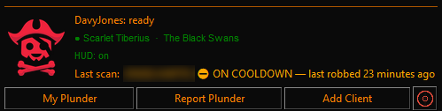
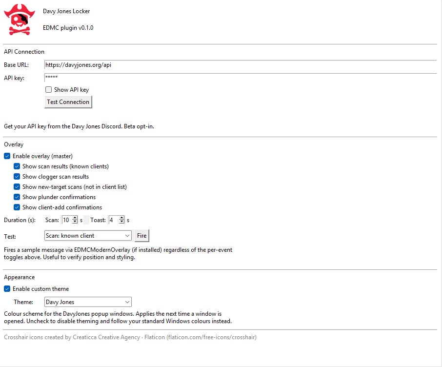
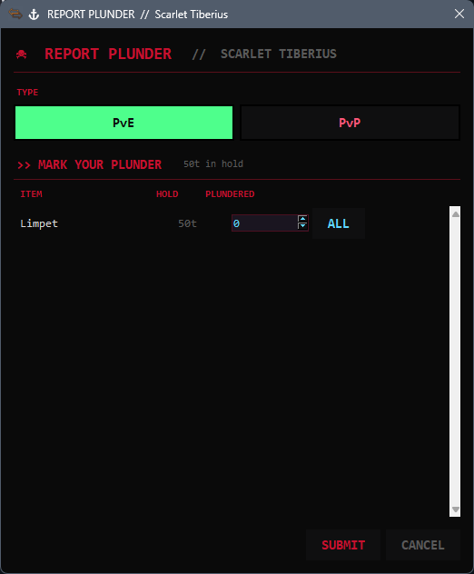
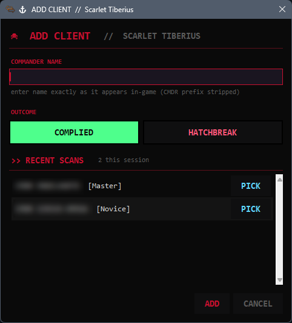
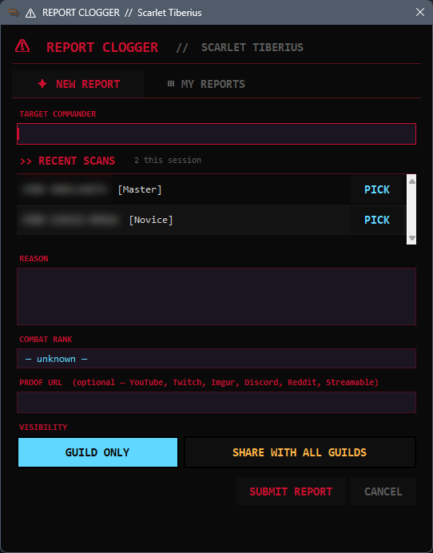
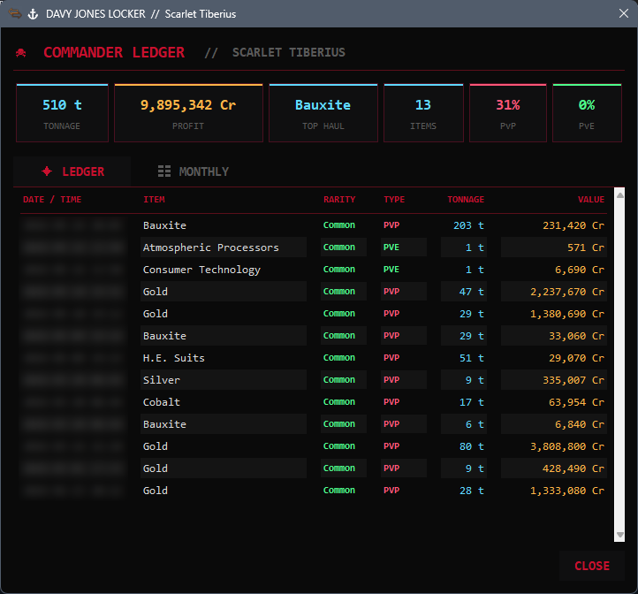

# DavyJones — Screen Guide

A walkthrough of every window in the plugin.

---

## Main panel

The plugin lives inside the EDMC main window. From top to bottom:

- **Status line** — shows `DavyJones: ready` when idle, or a short error if the API can't be reached.
- **Connection line** — your CMDR name and squadron, confirmed by the API after a successful key check. A green dot means connected; grey means not yet verified.
- **HUD line** — whether EDMCModernOverlay is detected. Shows `HUD: on` when active.
- **Last scan** — updated every time a CMDR scan completes. Includes name, status (known client / on cooldown / unknown / clogger), and time since last robbery.

The four buttons open the respective windows described below. The crosshair icon on the right opens the Clogger report window.

---

## Settings

Found under **File → Settings → DavyJones** in EDMC.

### API Connection

| Field | Description |
|---|---|
| Base URL | The squadron API root. Leave as `https://davyjones.org/api` unless told otherwise. |
| API key | Your personal key from the Davy Jones Discord. All requests are authenticated with this key. |
| Show API key | Unmasks the key field so you can verify what was pasted. |
| Test Connection | Fires a live request to `/me` and shows your CMDR name, squadron, key name, and expiry. |

### Overlay

The master toggle controls all HUD messages. Individual toggles below it let you silence specific events without disabling the whole overlay.

| Toggle | What it controls |
|---|---|
| Enable overlay (master) | All HUD output on/off. |
| Show scan results | Coloured banner when a scanned CMDR is found in the client list. |
| Show clogger scan results | Banner when a scanned CMDR has an active clogger report. |
| Show new-target scans | Banner for CMDRs not in the list. Off by default — fires on every scan. |
| Show plunder confirmations | Toast when a plunder report is submitted. |
| Show client-add confirmations | Toast when a client is added. |

**Duration (s)** sets how long messages stay on screen: *Scan* controls the scan-result banner, *Toast* controls the confirmation toasts.

**Test** fires a sample message — pick an event type from the dropdown and click **Fire**. Test messages bypass the per-event toggles above, so you can verify banner position and colour before going into the game.

### Appearance

| Setting | Description |
|---|---|
| Enable custom theme | On by default. Uncheck to disable theming and follow your standard Windows colours instead. When unchecked, the theme dropdown is greyed out (your chosen theme is remembered for when you turn it back on). |
| Theme | Colour scheme for the DavyJones popup windows. Options: **Davy Jones** (default — black/blood-red), **Imperial Gold**, **Classic Amber**, **Elite Orange**, and **Plain** (neutral dark grey). |

Theme changes apply the next time a window is opened — already-open windows aren't repainted. The EDMC main panel is unaffected; theming only covers the DavyJones popup windows.

---

## Report Plunder

Opened with the **Report Plunder** button. The cargo list is read from your current hold at the moment you click the button.

- **Type** — select PvE or PvP. This affects how the entry is recorded on the leaderboard.
- **Mark your plunder** — each cargo item shows the amount in your hold. Set how much of each item was plundered using the spinner, or hit **ALL** to fill the full hold amount.
- **Submit** — posts the report to the API. A HUD toast confirms success or failure.
- **Cancel** — closes without submitting.

Only items with a count above zero are sent.

---

## Add Client

Opened with the **Add Client** button. Adds a CMDR to the squadron client list so future scans recognise them.

- **Commander name** — enter the name exactly as it appears in-game, without the `CMDR` prefix. Case is not significant on the server.
- **Outcome** — choose **Complied** (they handed over cargo) or **Hatchbreak** (they were destroyed).
- **Recent scans** — CMDRs scanned during this session appear here with their combat rank. Click **Pick** to fill the name field automatically — avoids typos on names you've already seen.
- **Add** — submits to the API.
- **Cancel** — closes without submitting.

If the CMDR is already on the client list and still in their cooldown window (6 hours), the API returns a duplicate error and nothing is posted.

---

## Report Clogger

Opened via the crosshair button. Reports a CMDR who combat-logged during an encounter.

### New Report tab

- **Target commander** — the CMDR who logged. Use **Pick** from the recent scans list to avoid typing.
- **Reason** — describe what happened. Free text.
- **Combat rank** — pre-filled from the last scan of this CMDR if available; otherwise shown as `— unknown —`.
- **Proof URL** — optional link to evidence. Accepted sources: YouTube, Twitch, Imgur, Discord, Reddit (direct media links only), Streamable.
- **Visibility** — **Guild Only** keeps the report within your squadron; **Share With All Guilds** makes it visible across all squadrons using the platform.
- **Submit Report** — posts the report. You can re-report the same CMDR *after a 12-hour cooldown*; other reporters in your guild are not affected by your cooldown.
- **Cancel** — closes without submitting.

### My Reports tab

Lists all clogger reports you've submitted. Each entry shows the target CMDR, date, and current proof/visibility settings. You can update the proof URL or toggle visibility directly from the list.

---

## My Plunder (Stats)

Opened with the **My Plunder** button. Fetches your personal ledger from the API.

**Stat cards** across the top:

| Card | Description |
|---|---|
| Tonnage | Total cargo plundered across all submissions of the current year. |
| Profit | Estimated credit value of your plundered goods this year, using average market prices. |
| Top Haul | The commodity you've plundered the most of this year. |
| Items | Total number of individual line items reported this year. |
| PvP % | Your share of your guild's total PvP value this year. |
| PvE % | Your share of your guild's total PvE value this year. |

### Ledger tab

Your plunder reports for the current year, newest first. *Columns*: date/time, item, rarity, type (PvP/PvE), tonnage, and estimated value. *Rarity* is colour-coded: common is dim and rare is amber.

### Monthly tab

Month-by-month breakdown for the current year, with PvP and PvE tonnage and value shown separately for each month. The current month is highlighted.
